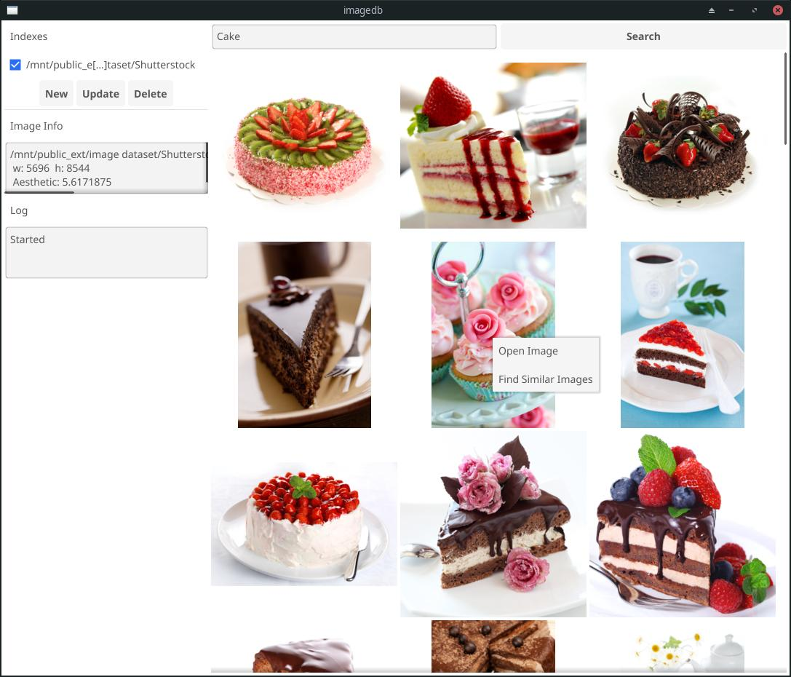

# imagedb

A GUI software to facilitate indexing and searching an untagged collection of images locally.

## Features

- Index all images under multiple distinct directories
- Updating an indexed folder only indexes new images
- Search your indexed image collections for images based on similarity with other images
- Search your indexed image collections with arbitrary text captions

## Installing and Running

- [Go](https://go.dev) and [cgo](https://github.com/go101/go101/wiki/CGO-Environment-Setup) are required for compiling or running the UI from source (I may eventually add an actual *release*)
- git clone this project  `git clone https://github.com/crimro-se/imagedb.git`
- Create and activate either a [python venv](https://docs.python.org/3/library/venv.html) or [conda environment](https://docs.conda.io/projects/conda/en/latest/user-guide/tasks/manage-environments.html)
- `cd embeddingserver`
- if your hardware requires a specialist [pytorch installation](https://pytorch.org/get-started/locally/) (AMD gpu, etc), do that manually first.
- install dependencies: `pip install -r requirements.txt`
- start the embedding server `python server.py`
- in another terminal, you can start the gui with `go run .` or compile an executable with `go build .`

## Usage

- you'll need to activate your python environment and start the embedding server first (server.py in embeddingserver folder) if you want to index more images or search with text.
- To index a new folder of images, first click the New button at the top left.
- Select the folder you want to index with the directory selector UI.
- Now you should see that directory added to the list of indexes at the top left. Click on it to check it.
- Click on the Update button and start the indexing process.
- You can change settings by editing `config.ini` and restarting the UI.

## Why

This was an experimental project just to try out [sqlite-vec](https://github.com/asg017/sqlite-vec) (a vector database plugin for sqlite) as well as the [Fyne](https://fyne.io/) UI library for Golang.